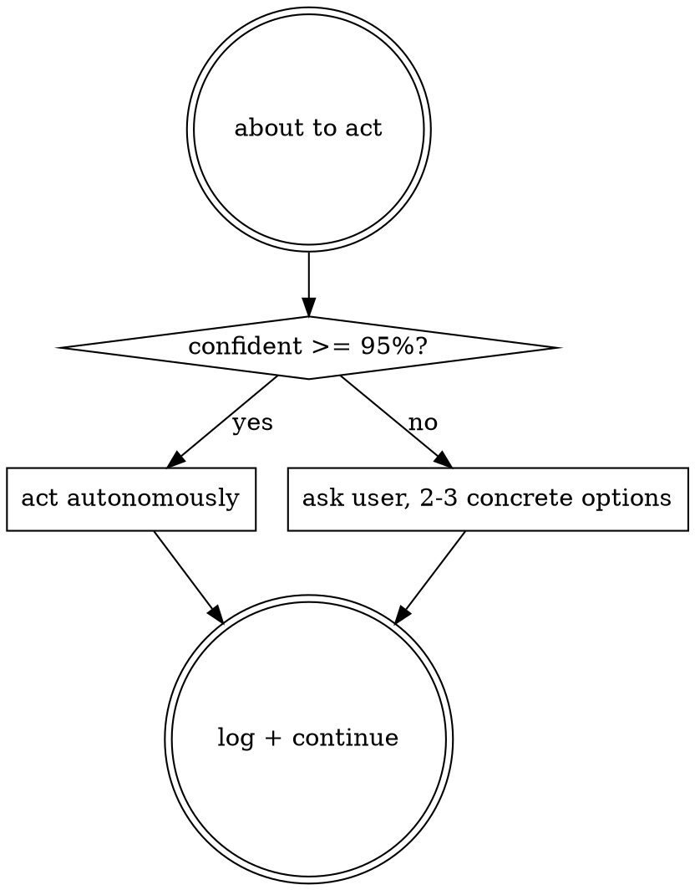

# CLoClo Pipeline

Chains SuperPowers skills (brainstorming, writing-plans, subagent-driven-
development, verification) with autonomous reviews (Codex + CodeRabbit)
and a PR-first auto-merge flow. Invokes underlying skills — does not
reimplement them.

## When to Use

`/pipeline`, "new feature", "build X", "implement Y". Multi-step work
worth spec → plan → impl → verify gating. Not for one-liners, typos,
or reads.

## Invocation — no flags, ever

- `/pipeline` → auto-detect existing artifacts. If any exist, ask A/B/C
  in the terminal. Else run fresh from Phase 1.
- `/pipeline <free text>` → interpret text as a directive, skip the
  dialogue. Examples: `passe au plan`, `le code est ecrit revois`,
  `refais tout`, `pas de codex`, `ship mode`, `pas de PR`.

French, English, and mixed phrasing all accepted. 80% clear intent →
act and log. Ambiguity → one clarifying terminal question. Full
directive vocabulary: `references/smart-resume.md`.

## The Pipeline Flow

| # | Phase | Skill invoked | Output |
|---|-------|---------------|--------|
| 1 | Design | `superpowers:brainstorming` | `01-spec.md` |
| 2 | Review spec (auto-integrate) | `codex-review` (spec) | `02-codex-review-spec.md` |
| 3 | Plan | `superpowers:writing-plans` | `04-plan.md` |
| 4 | Review plan (auto-integrate) | `codex-review` (plan) | `05-codex-review-plan.md` |
| 4.5 | Task DAG + briefs | inline | `08-task-dag.md`, `task-briefs/` |
| 5 | Execute | `superpowers:subagent-driven-development` | commits on feature branch |
| 6 | Review impl arch (auto-integrate) | `codex-review` (impl) | `07-codex-review-impl.md` |
| 6.5 | Review impl static (opt-in when Phase 9 runs) | `coderabbit-review` | `07b-coderabbit-review-impl.md` |
| 7 | Verify | `superpowers:verification-before-completion` | `09-compliance-report.md` |
| 7.5 | Visual verify (if UI) | `agent-browser` | `screenshots/` |
| 8 | Wiki ingest (auto) | inline | wiki updated |
| 9 | Open PR + multi-bot auto-integrate + auto-merge | `superpowers:finishing-a-development-branch` | PR URL, merged, branch deleted |

Full per-phase execution: `references/phases.md`.

## Confidence-First Principle (applies everywhere)

**Autonomous does not mean guessing.** Every decision — applying a
finding, skipping it, interpreting a directive, picking a default —
passes a confidence check. Below 95% confidence, ask the user.



**When to ask** (non-exhaustive): two valid interpretations of a user
directive, reviewer finding touching out-of-scope code, test failure
that could be regression or flake, CI red that could be infra, any
"I think X but could be Y" situation.

**Ask format — always the same:**

```
{Question en une phrase}

Contexte : {1-2 lignes expliquant pourquoi}

Options :
A. {option 1 concrete}                    ← recommandee
B. {option 2}
C. {option 3 si pertinent}

Ou tape ta reponse en texte libre.
```

2-3 concrete options, mark the recommended one, accept free-form text,
terminal only — never GitHub.

**Don't ask** when the answer is in `pipeline.config.md`, CLAUDE.md, or
memory; or when the decision is reversible and low-impact. Don't ask
trivial questions, don't guess on hard ones.

## Auto-Integration — The 3 Gates

Every review phase (2, 4, 6, 6.5, 9) applies findings automatically
under the same rule. A finding is auto-applied only when ALL three
gates pass:

1. **Concrete patch or revision provided.** Bot/reviewer gave a diff,
   an AI-Agent prompt with file:line+replacement, or for spec/plan a
   specific section + exact new text. Judgment-only findings
   ("consider refactoring X") are skipped.
2. **Not auth / payments / data migration.** Critical domains escalate
   to the user even with a concrete patch.
3. **No conflicting patches across reviewers or findings.** Different
   fixes at the same file:line → skip both, log `[CONFLICT]`, ask.

**Iteration cap:** 3 rounds for code phases, 2 for spec/plan. After
cap, exit loop and escalate any remaining critical findings.

**Commit format for auto-applied fixes:**

```
fix(phase-{N}): auto-apply {reviewer} findings ({N} fixes)

- [file:line] — description
- [CONSENSUS file:line] — description (Codex + CodeRabbit agreed)

Skipped (judgment-only or critical domain):
- [file:line] — reason
```

## PR-First + Auto-Merge (Phase 9)

Phase 9 opens a Pull Request via `superpowers:finishing-a-development-
branch`, waits 10 min for installed bots, auto-applies their concrete
patches under the 3 gates, re-reviews, and auto-merges with
`--delete-branch` when clean. The user stays in the terminal.

**Default bots** (no extra config once installed): CodeRabbit GitHub App
+ Gemini Code Assist. **Opt-in:** Codex Cloud, Claude Code Action. Full
stack + install URLs: `references/bot-stack.md`.

**Consensus amplification:** when BOTH Codex and CodeRabbit flag the
same file:line → `[CONSENSUS]`, escalate severity to the higher, apply
even if standalone would skip (consensus beats the 3-gate skip).

**Disagreement handling:** spread > 1 severity level AND higher is
`critical` → escalate. Otherwise apply the higher-severity fix and log
the disagreement. Never average.

**Escalation triggers:** iteration cap hit with criticals open, patch
failed to apply (merge conflict or compile error), CI/required
reviewers block merge, cross-reviewer `[DISAGREEMENT]` at critical
severity. Escalation is terminal-only with the standard ask format.

**Branch lifecycle:** on successful auto-merge,
`gh pr merge --squash --delete-branch --auto` removes the branch
locally AND on the remote. On escalation, the branch stays alive so
the user can push manual fixes and resume.

## Session Setup

1. Take the user message (or ask what to build if empty)
2. Create `docs/cloclo-sessions/YYYY-MM-DD-<slug>/`
3. Init `session.log`:
   `[timestamp] CLoClo session started: <slug>`
   `[timestamp] Prerequisites: superpowers=OK, codex=OK|MISSING, coderabbit=OK|MISSING`
4. Optional `pipeline.config.md` for project-specific verification commands

## Supporting References

Heavy detail, variant tables, and lookups live in `references/`:

- `smart-resume.md` — detection map, A/B/C dialogue, directive interpretation table
- `bot-stack.md` — default + opt-in bot list with install URLs and costs
- `phases.md` — full per-phase execution (the longest reference, 450+ lines)
- `prerequisites.md` — SuperPowers/Codex/CodeRabbit/agent-browser auto-install + degraded modes
- `model-policy.md` — Opus/Sonnet/Haiku mixed policy, per-phase assignments
- `retries.md` — bounded retries, spike/dev/ship maturity levels
- `session-files.md` — session dir layout, checkpoint.json, handoff.md formats

## Important Rules

1. **Invoke underlying skills; never reimplement them.** SuperPowers,
   Codex, CodeRabbit, and the finishing skill do the real work.
2. **Phase 1 (brainstorming) is the only scheduled interactive phase.**
   Every other phase auto-integrates under the 3 gates. BUT
   Confidence-First applies universally — ask when unsure, don't guess.
3. **Questions stay in the terminal, never on GitHub.** The user should
   never have to open the GitHub UI to answer the pipeline.
4. **No flags, ever.** Natural-language directives replace every flag
   use case. Escape hatch = edit the session dir before re-running.
5. **Each phase outputs to the session dir** with numbered filenames
   for traceability.
6. **Checkpoint after every phase; handoff on exit, always.** Session
   resumes via `checkpoint.json` after any crash.
7. **SuperPowers specs/plans live in their own directories**
   (`docs/superpowers/specs/`, `docs/superpowers/plans/`). CLoClo
   copies/symlinks them into the session dir.
8. **Wiki ingest (Phase 8) is automatic and silent.** Skipped when no
   wiki exists in the project.
9. **Reviews NEVER auto-skip.** Codex fails → Claude subagent fallback.
   CodeRabbit fails → warn and continue (static analysis is a safety
   net, not a blocker).
10. **Branch deleted on auto-merge success** (`--delete-branch` flag).
    On escalation the branch stays alive so the user can push manual
    fixes and rerun `/pipeline`.
