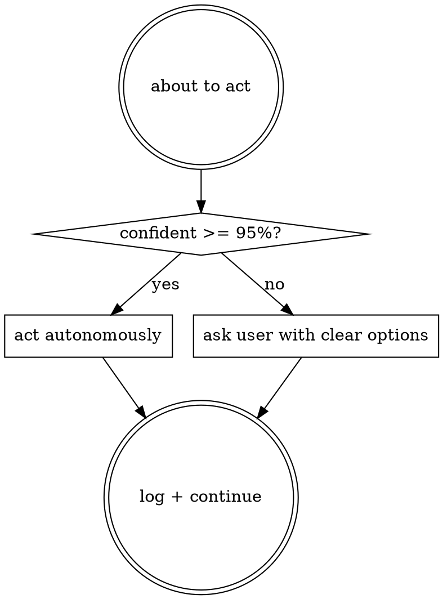

# Confidence-First Principle

**Autonomous does not mean guessing.** Every decision the pipeline makes —
whether to apply a finding, skip it, interpret a directive, pick a default
— passes a confidence check. Below 95% confidence, ask the user.

## Decision Flow



## When to Ask (non-exhaustive)

- Two valid interpretations of a user directive and the intents differ
- Reviewer finding that touches out-of-scope code (not in current change)
- Test failure in Phase 7 that could be regression OR flake
- CI red that could be transient infra OR a real break
- Any "I think X but could be Y" situation

## Ask Format (always the same)

```
{Question en une phrase}

Contexte : {1-2 lignes expliquant pourquoi la question se pose}

Options :
A. {option 1 concrete}                                    ← recommandee
B. {option 2}
C. {option 3 si pertinent}

Ou tape ta reponse en texte libre.
```

- 2-3 concrete options (not open-ended)
- Mark the recommended option when there is one
- Free-form response always accepted
- Terminal only, never GitHub

## When NOT to Ask

- Answer is already in `pipeline.config.md` or existing artifacts
- User's `CLAUDE.md` / memory answers it unambiguously
- Decision is reversible and low-impact (apply then let user correct on
  next iteration)

Don't ask trivial questions, don't guess on hard ones.

## Applies Across All Phases

This principle is not tied to specific escalation points. It overrides
any phase's default auto-integration when confidence drops. Phase 6
auto-applying a code fix? Confidence check. Phase 9 auto-merging a PR?
Confidence check. Smart-resume interpreting "passe au plan"? Confidence
check.
