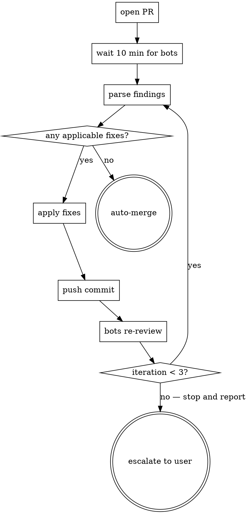

# Phase Details

Detailed execution for each phase. The main SKILL.md provides the overview
table; this file has the per-phase specifics.

## Phase 1: Design — `superpowers:brainstorming`

Invoke `Skill("superpowers:brainstorming")`. Gives one-question-at-a-time
exploration, HTML mockups, A/B/C option framing, spec self-review, user
approval gate.

**Output:** spec in `docs/superpowers/specs/YYYY-MM-DD-*-design.md`.
Copy or symlink to `{session_dir}/01-spec.md`.

**GATE:** Do not proceed until user explicitly approves the spec.

## Phase 2: Spec Review (Auto-Integrate) — Codex + GLM in parallel

Two independent reviewers run simultaneously. Each sees the same spec, writes to its
own output file, and the calling skill merges their findings via the consensus matrix.

**Codex (primary, GPT-5.4):**
- Invoke `codex-review` skill with:
  - `review_type`: `spec`
  - `input_file`: `{session_dir}/01-spec.md`
  - `output_file`: `{session_dir}/02-codex-review-spec.md`

**GLM-5.1 (parallel, via Z.ai Anthropic-compatible endpoint):**
- Invoke `glm-review` skill with the same parameters but:
  - `output_file`: `{session_dir}/02-glm-review-spec.md`

**Parallel dispatch pattern:**
```bash
(invoke codex-review ...) &  CODEX_PID=$!
(invoke glm-review   ...) &  GLM_PID=$!
wait $CODEX_PID; wait $GLM_PID
```

Both run in background jobs; the skill waits for both before proceeding. Typical
total time = max(codex_time, glm_time) ≈ 3-8 minutes (limited by the slower model,
not the sum).

**Availability gates:**
- Codex unavailable (CLI missing, usage limit) → its built-in Claude fallback runs. Never skipped silently.
- GLM unavailable (no Z.ai key, API down) → **skipped with warning**, no fallback. Codex still produces a review, so the phase still has ≥1 opinion.
- Both unavailable → log warning, proceed to next phase without review. This is the only case where Phase 2 actually skips entirely.

**Auto-Integration (replaces old Decision Point #1):**

Apply the same 3-gate rule as Phase 9 Step 5, adapted for spec content:
1. **Concrete revision available** — reviewer identified specific section + what it should say (not vague "consider X").
2. **Not a design pivot** — reviewer flagged an inconsistency, missing edge case, or infeasibility (factual). Semantic design alternatives ("approach A vs B") do NOT auto-apply — escalate.
3. **No contradictions** — if two reviewer findings contradict each other at the same section, skip both, log `[CONFLICT]`.

Apply qualifying findings, rewrite spec → `{session_dir}/03-spec-v2.md`.

**Escalation** (terminal, not GitHub) only when:
- Reviewer finds a design pivot (approach A vs B) — user must choose
- Two findings contradict at the same section
- Iteration cap (2) hit with remaining critical findings

Log: `[timestamp] Phase 2 auto-integrate: {N} applied, {S} skipped, {E} escalated`.

## Phase 3: Plan — `superpowers:writing-plans`

Invoke `Skill("superpowers:writing-plans")`. Input: approved spec (01-spec.md
or 03-spec-v2.md). Produces bite-sized tasks, TDD cycle, complete code blocks,
pre-written commit messages.

**Output:** plan in `docs/superpowers/plans/YYYY-MM-DD-*.md` →
`{session_dir}/04-plan.md`.

## Phase 4: Plan Review (Auto-Integrate) — Codex + GLM in parallel

Same parallel dispatch as Phase 2. Both reviewers see the plan, the approved spec,
and write independent findings.

- `codex-review`: `review_type: plan`, `output_file: 05-codex-review-plan.md`
- `glm-review`:   `review_type: plan`, `output_file: 05-glm-review-plan.md`
- Both receive `input_file: {session_dir}/04-plan.md` and `spec_path: <approved spec>`.

Background-job dispatch + `wait` identical to Phase 2. GLM skip-on-missing-key
semantics identical to Phase 2.

**Auto-Integration (replaces old Decision Point #2):** same 3-gate rule
as Phase 2 (concrete revision + factual fix + no contradictions). Apply
qualifying findings, rewrite plan → `{session_dir}/06-plan-v2.md`.

**Escalation** only when the reviewer flags a circular task dependency
that the LLM rewrite can't resolve, a spec-plan mismatch requiring spec
edits, or the iteration cap (2) is hit. Log same format as Phase 2.

## Phase 4.5: Task DAG + Sub-Agent Briefs

### Step 1: Build DAG

Read the plan, extract tasks. For each: `depends_on`, `files_owned`,
`files_readonly`, `files_forbidden`. Tasks with no mutual deps run in parallel
(same wave).

### Step 2: Generate Briefs

For each task, write `{session_dir}/task-briefs/task-{N}.md`:

```markdown
## Task Brief: {N} — {title}

### TASK
{what to implement — from plan}

### SCOPE
- OWNED files (write): {list}
- READ-ONLY files: {list}
- FORBIDDEN files: {list}

### SPEC REFERENCE
{link to spec section}

### SUCCESS CRITERIA
{numbered ACs: AC-001, AC-002}

### DEPENDENCIES
- Depends on: {task numbers or "none"}
- Depended on by: {task numbers or "none"}

### LEARNINGS TO APPLY
{relevant `.shipguard/mistakes.md` entries, if any}
```

### Step 3: Dispatch Waves

- Wave 1: tasks with no deps (parallel)
- Wave 2: tasks whose deps are all in Wave 1
- Wave N: ...

Between waves, verify previous wave succeeded.

### Stakes-Based Approval Matrix

|                | Easy to reverse                | Hard to reverse                |
|----------------|---------------------------------|---------------------------------|
| **Low stakes** | Auto-dispatch                   | Quick confirm: "Task N ok?"     |
| **High stakes**| Show plan, auto-dispatch        | **Explicit approval required**  |

- High stakes = auth, payments, data migration, production config, or >5 files
- Hard to reverse = DB schema changes, file deletions, API contract changes
- Spike maturity: auto-dispatch everything
- Dev maturity: use matrix
- Ship maturity: minimum quick-confirm everywhere

Write DAG + wave plan to `{session_dir}/08-task-dag.md`.

## Phase 5: Execute — `superpowers:subagent-driven-development`

Invoke `Skill("superpowers:subagent-driven-development")`. Input: approved plan
+ task briefs. Fresh subagent per task, two-stage review (spec compliance
then code quality), status handling (DONE / DONE_WITH_CONCERNS / BLOCKED /
NEEDS_CONTEXT).

**Model selection:** apply policy from `model-policy.md`. If implementer
returns BLOCKED on Sonnet due to reasoning issue, re-dispatch with Opus.

Record `base_ref` (SHA before execution) and `commit_list` (all new commits).

## Phase 6: Implementation Review (Auto-Integrate) — Codex + GLM in parallel

Same parallel dispatch pattern. Both reviewers see the spec, plan, base_ref, and
commit_list. They produce independent findings files, merged through the 3-reviewer
consensus matrix (GLM counts as a 3rd voice alongside Codex and, if enabled, CodeRabbit
CLI in Phase 6.5).

- `codex-review`: `review_type: impl`, `output_file: 07-codex-review-impl.md`
- `glm-review`:   `review_type: impl`, `output_file: 07-glm-review-impl.md`
- Both receive `spec_path`, `plan_path`, `base_ref`, `commit_list`.

**Consensus extensions for 2+ reviewers:**
- 2-of-2 agreement on a file:line → `[CONSENSUS]`, severity max, apply.
- 2-of-3 agreement (if CodeRabbit 6.5 runs too) → `[MAJORITY]`, apply.
- 1-of-2 or 1-of-3 flag → present to the 3-gate auto-integration (same as today).

**Auto-Integration (replaces old Decision Point #3):** same 3-gate rule
as Phase 9 (concrete patch + non-critical domain + no cross-finding
conflict). Apply qualifying fixes as new commits on the feature branch.

Commit format:
```
fix(phase-6): auto-apply Codex findings ({N} fixes)

- file:line — description
- ...

Skipped (judgment-only or critical domain):
- file:line — reason
```

**Escalation** only when the iteration cap (3) is hit with remaining
`critical` or `high` findings, or a finding lands in auth / payments /
data migration and needs human judgment.

## Phase 6.5: CodeRabbit Review (opt-in when Phase 9 runs, Auto-Integrate)

When enabled (either `--coderabbit-cli` flag, `maturity=ship`, or App not
installed on repo), invoke `coderabbit-review` skill with:
- `session_dir`: current session dir
- `output_file`: `{session_dir}/07b-coderabbit-review-impl.md`
- `base_ref`: git SHA from Phase 5

If CodeRabbit CLI unavailable → skip with warning.

**Auto-Integration (replaces old Decision Point #3b):** same 3-gate rule.

If both Codex AND CodeRabbit flag the same file:line → mark `[CONSENSUS]`,
escalate severity to the higher of the two, and apply (higher evidence
weight → worth applying even on lower-confidence standalone findings).

## Phase 7: Verify — `superpowers:verification-before-completion`

Invoke `Skill("superpowers:verification-before-completion")`. Iron Law: NO
COMPLETION CLAIMS WITHOUT FRESH VERIFICATION EVIDENCE. 5-step Gate Function
(IDENTIFY → RUN → READ → VERIFY → ONLY THEN).

If `pipeline.config.md` exists, use its verification commands. Otherwise
auto-detect or ask the user.

### AC-Level Spec Compliance Report

After verification passes, produce `{session_dir}/09-compliance-report.md`:

```markdown
| AC | Description | Test | Status |
|----|-------------|------|--------|
| AC-001 | User can upload PDF | test_upload_pdf() in tests/test_upload.py:42 | COVERED |
| AC-002 | Upload rejects >50MB | test_upload_size_limit() in tests/test_upload.py:67 | COVERED |
| AC-003 | Progress bar during upload | — | NOT COVERED |
```

- Extract ACs from approved spec. If spec has no numbered ACs, derive from requirements sections.
- For each AC: grep codebase for tests that exercise that behavior.
- COVERED = at least one passing test directly verifies the criterion.
- NOT COVERED → flag, don't block. User decides.

## Phase 7.5: Visual Verification (If UI Modified)

Runs only if Phase 5 touched `.tsx`, `.jsx`, `.vue`, `.svelte`, `.html`,
`.css`, `.scss`.

1. `git diff --name-only {base_ref}..HEAD | grep -E '\.(tsx|jsx|vue|svelte|html|css|scss)$'`
2. For each affected page: `agent-browser open <url>`, `snapshot`,
   `screenshot {session_dir}/screenshots/<page>.png`
3. **Read and verify EVERY screenshot immediately.** Unread = not verified.
4. If issues → fix code → re-run → new commit.

Use the project's actual port (typically from docker/dev server), never assume.

## Phase 8: Wiki Ingest (Automatic)

Runs if `wiki/schema.md` exists. Otherwise skip silently.

1. Read `wiki/schema.md` + `wiki/index.md` for context
2. Create combined session source at `wiki/sources/YYYY-MM-DD-pipeline-<slug>.md`:
   - Spec summary (key decisions, trade-offs)
   - Codex + CodeRabbit findings (bugs caught, patterns flagged)
   - Implementation decisions (architecture choices, rejected alternatives)
   - Verification (what was tested, what passed)
3. Create source summary at `wiki/pages/sources/YYYY-MM-DD-pipeline-<slug>.md`
4. Update/create entity + concept pages for: new components/services/modules,
   patterns established/changed, bugs found + fixes, architecture decisions
5. Update `wiki/index.md`
6. Append to `wiki/log.md`:
   ```
   ## [YYYY-MM-DD HH:MM] INGEST | Pipeline session: <slug>
   - Source: sources/YYYY-MM-DD-pipeline-<slug>.md
   - Pages created: <list>
   - Pages updated: <list>
   ```

## Phase 9: Open PR + Multi-Bot Review

Since 0.5.0 the pipeline ends by opening a Pull Request. The PR triggers all
review bots installed on the repo — each angle reinforces the others.

### Step 1: Ensure feature branch

Phase 5 should have produced commits on a non-main branch. If the pipeline
was run directly on main (not recommended), create a branch now:

```bash
# Fail early if the tree is dirty — mixing WIP changes into an auto-generated
# branch hides whose changes went where.
if ! git diff --quiet HEAD -- || [ -n "$(git ls-files --others --exclude-standard)" ]; then
  echo "error: uncommitted or untracked changes — commit or stash before Phase 9" >&2
  exit 1
fi

CURRENT="$(git rev-parse --abbrev-ref HEAD)"
if [ "$CURRENT" = "main" ] || [ "$CURRENT" = "master" ]; then
  BRANCH="pipeline/$(basename "$session_dir")"
  # -B makes re-runs idempotent (reuse branch at current HEAD) while refusing
  # to silently clobber an existing branch that points somewhere else.
  if git rev-parse --verify --quiet "$BRANCH" >/dev/null && \
     [ "$(git rev-parse "$BRANCH")" != "$(git rev-parse HEAD)" ]; then
    echo "error: branch $BRANCH already exists at a different commit" >&2
    exit 1
  fi
  git checkout -B "$BRANCH"
fi
# Otherwise we are already on a feature branch — nothing to do.
```

### Step 2: Invoke `superpowers:finishing-a-development-branch`

Invoke `Skill("superpowers:finishing-a-development-branch")`. That skill
handles:
- Pre-push checks (tests pass, no WIP commits, branch rebased on main)
- Push to remote
- PR creation with structured summary (links spec, plan, Codex/CodeRabbit
  review files, compliance report)
- PR URL returned to the main conversation

### Step 3: Wait for bot reviews

After PR opens, bots take 2-10 minutes each (CodeRabbit ~3 min, Gemini ~2 min,
Codex Cloud ~5 min, Claude Action depends on workflow). Wait for at least ONE
bot to post AND a minimum of 10 minutes elapsed, whichever comes first. Poll
comments + reviews (not just comments — several bots post via `reviews`):

```bash
# Strict match: author exact (left-anchored, optional -[suffix]) avoids false
# positives like "coderabbits-fork" or "my-gemini-bot".
gh pr view --json comments,reviews --jq '
  ([.comments[] | {who: .author.login, source: "comment", body: .body}]
   + [.reviews[]  | {who: .author.login, source: "review",  body: .body}])
  | map(select(.who | test("^(coderabbitai|gemini-code-assist|chatgpt-codex-connector|claude-bot)$")))
'
```

Regex is anchored and lists each bot's exact login. Extend the alternation
when adding a new bot — do not loosen to substring match.

**Supported bots** (install once per repo/org, then auto-review every PR):

| Bot | GitHub App / Action | Review style | Default? |
|-----|---------------------|--------------|----------|
| CodeRabbit | github.com/apps/coderabbitai | Inline nits + summary, [CHILL/ASSERTIVE] profile | **Yes** |
| Gemini Code Assist | github.com/apps/gemini-code-assist | High-level architecture comments | **Yes** |
| Codex Cloud | chatgpt.com/codex (connect repo) | Spec compliance, test suggestions | Opt-in |
| Claude Code Action | anthropics/claude-code-action | Config via GitHub Actions workflow | Opt-in |

Default stack = CodeRabbit + Gemini (2 angles, both zero-config after install).
Opt-in to Codex Cloud / Claude Action only when the extra perspective is worth
the config overhead — they do NOT need to be on every PR by default.

**Codex Cloud is specifically opt-in because Phase 6 already ran `codex-review`
against the same commits.** Waiting for `chatgpt-codex-connector[bot]` on the
PR re-reviews code that Codex has already inspected once, consuming quota and
surfacing duplicated findings. The regex above still lists the bot so that
users who opted in (via `/pipeline avec codex cloud` or the `bots.codex_cloud`
flag in `pipeline.config.md`) see their output — if Codex Cloud is not opted
in, the login simply never appears in the poll results and the loop ignores
it. Full rationale and opt-in syntax: `bot-stack.md`.

Wait until at least one bot has posted a comment OR 5 minutes have elapsed,
whichever comes first.

### Step 4: Aggregate findings

Read each bot's comments. Produce a consolidated digest
`{session_dir}/10-pr-bot-digest.md`:

```markdown
# PR #<N> — Multi-Bot Review Digest (iteration {K})

## CodeRabbit ({M findings})
- [file:line] — severity — description — patch: yes/no

## Gemini Code Assist ({M findings})
- ...

## Consensus Findings
Items flagged by 2+ bots at the same file:line:
- [CONSENSUS high] file:line — ...

## Disagreements
Items where bots disagree on severity:
- [DISAGREEMENT] file:line — CodeRabbit: high | Gemini: low — ...
```

### Step 5: Auto-Integration Loop (no user interaction)

**The user is NEVER asked to visit GitHub during Phase 9.** Everything
happens in the terminal: findings parsed, fixes applied, PR updated,
re-reviewed, merged when clean.



**An "applicable fix" must meet ALL three gates:**

1. **Concrete patch available.** The bot provided a diff block or an "AI
   Agent prompt" with file:line and exact replacement text. Pure
   LLM-judgment findings ("consider refactoring X") are skipped — they lack
   the concrete patch needed for autonomous apply.

2. **No auth / payments / data migration domain.** Auto-apply is forbidden
   in these critical domains even with a concrete patch. Escalate instead.

3. **No conflicting patches across bots.** If CodeRabbit and Gemini propose
   different fixes at the same file:line, skip both and log
   `[CONFLICT — manual review needed]`.

**Commit format per iteration:**
```
fix(pipeline): iteration {K} auto-apply ({N} fixes)

Applied by Phase 9 auto-integration from bot findings on PR #<N>:
- [CodeRabbit] file:line — description
- [Gemini]     file:line — description
- [CONSENSUS]  file:line — description

Skipped (judgment-only or conflict):
- file:line — reason
```

**Iteration cap: 3.** After 3 iterations, exit loop even if findings
remain. Report the final unresolved items in the handoff.

### Step 6: Auto-Merge (default) or Escalation (exception)

**Clean path — auto-merge:**

If iteration loop exits with zero remaining `critical` or `high` findings,
merge automatically:

```bash
gh pr merge --squash --delete-branch --auto
```

Write to `session.log`:
```
[timestamp] Phase 9 auto-merged PR #<N> | {N0} findings caught, {A} auto-applied,
{S} skipped, final: CLEAN
```

**Escalation path — only when blocked:**

Escalate to the user (in the terminal, NOT on GitHub) ONLY when one of:

- Iteration cap (3) hit with `critical` or `high` findings still open
- A fix patch failed to apply (merge conflict or compile error)
- CI / required reviewers block the merge
- Consensus `[DISAGREEMENT]` at `critical` severity — bots disagree, can't decide

Escalation message (French, per user's local IA language):
```
Phase 9 bloquée sur PR #<N> — la boucle auto n'a pas pu finir.

Cause: {iteration_cap | fix_failed | ci_blocked | disagreement}
Findings restants: {N} (dont {C} critical/high)

Fichiers:
- Digest: {session_dir}/10-pr-bot-digest.md
- PR URL: {pr_url}

Options:
A. Fix manuellement en local et dis "continue" → je merge
B. Laisse la PR ouverte, on passera plus tard
C. Force-merge quand meme (gh pr merge --squash --admin)
```

This is the ONLY point where the user might need to touch GitHub — and
only when the autonomous loop genuinely cannot resolve.

### Step 7: Report (always)

Whether auto-merged or escalated, write a terminal summary:

```
Phase 9 summary (PR #<N>):
  Bots: {list}
  Findings caught: {total}
  Auto-applied: {applied_count} ({applied_details})
  Skipped: {skipped_count} ({skipped_reasons})
  Final state: MERGED | ESCALATED | OPEN
  Session digest: {session_dir}/10-pr-bot-digest.md
```

No GitHub visit required on the clean path.

### Skip Conditions

- `maturity: spike` → skip Phase 9, direct commit to main allowed
- No remote configured (offline / local-only) → skip with warning

Phase 9 runs automatically in `dev` and `ship` maturity with no opt-out
flag. If the user needs to opt out for a specific session, they set
`maturity: spike` in `pipeline.config.md` before running.

### Token Efficiency Note

Phase 9 adds 5-15 minutes to the pipeline (bots review + auto-apply + re-review).
Each bot catches different bugs, fixes are auto-applied with patch guardrails,
and the permanent GitHub PR record is more valuable than session-dir files
alone for future audits. The user stays in the terminal; no context switch
to the GitHub UI.

## Phase 9.5: Post-Merge GLM Review (Open-Bar Safety Net)

Runs only when `glm-review` is available (Z.ai key present). Fires **after** the
squash-merge of Phase 9 has landed on `main`. Catches two classes of problems the
PR review loop can miss:

1. **Squash-merge regressions.** Iteration rounds 1..N each looked good in isolation,
   but the final squashed commit combines them in ways no intermediate diff
   exposed.
2. **Cross-PR drift.** Between Phase 9 opening the PR and the auto-merge landing,
   other commits may have merged to `main`. GLM reviews the post-merge HEAD so the
   final state gets an independent pass.

### Execution

```bash
invoke glm-review with:
  review_type: impl
  input_file:  {session_dir}/04-plan.md     # reference plan, still valid
  output_file: {session_dir}/11-glm-post-merge-review.md
  spec_path:   {approved_spec}
  plan_path:   {approved_plan}
  base_ref:    <sha of main BEFORE the squash-merge>
  commit_list: <squash_merge_sha>
```

### Findings handling

Non-blocking by default. GLM findings on post-merge HEAD are written to
`11-glm-post-merge-review.md` and summarized in the handoff (`handoff.md`) as:

```
## Post-merge GLM review
- Findings: N (P0: x, P1: y, P2: z)
- File:    {session_dir}/11-glm-post-merge-review.md
- Action:  {automatic | user follow-up needed}
```

- 0 findings → logged, pipeline exits clean.
- P2-only findings → logged in handoff as "nits", no action.
- P1 findings → flagged in handoff, user decides in next session whether to fix.
- **P0 findings → auto-escalate.** The user is alerted in the terminal with the 3-option ask (fix now / schedule follow-up / ignore with rationale).

### Why this is cheap

Z.ai GLM quota is open-bar for this user, so running a 4th independent model pass
after the PR merges costs nothing and catches rare-but-real regressions that slip
through the multi-bot PR loop. If the Z.ai key is missing, the phase is a silent
no-op (same skip semantics as Phase 2/4/6 GLM dispatch).

### Skip Conditions

- No Z.ai API key available → silent skip.
- `maturity: spike` → skip (Phase 9 itself was skipped, so there's nothing to post-review).
- Phase 9 escalated instead of merging → skip (the PR is still open; post-merge review is N/A until merge lands).
